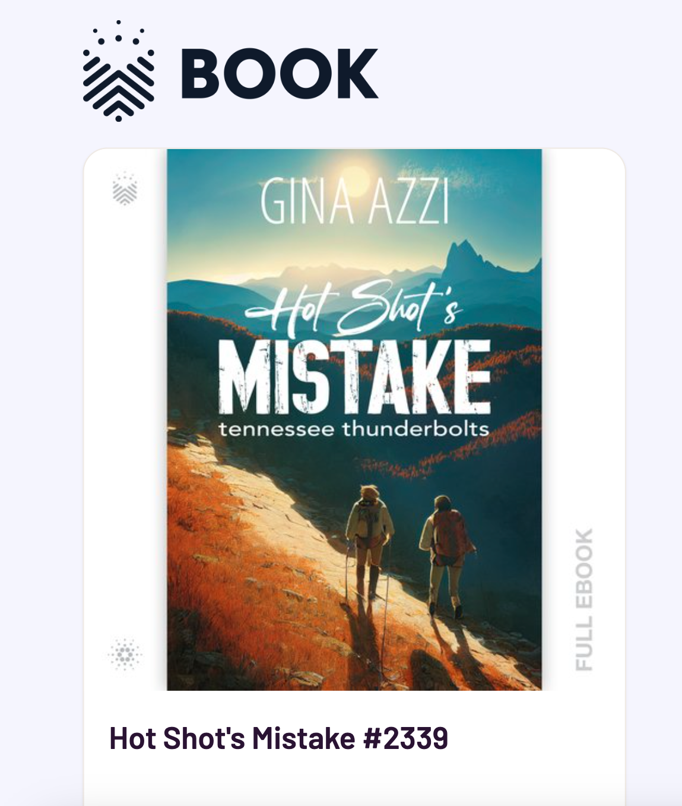

 

Cofounders Ben Illian (left) and Joshua Stone 

 
There are lots of digital platforms out there where you can buy ebooks or audiobooks, but it doesn’t mean that you are the real 
owner of that book. These platforms only give you the license to view the book or listen to the audio. Because you can not sell them on the market.
When the company goes bankrupt, you lose your access to books forever.

#### <u>[Book.io](http://Book.io)</u> brings books to the blockchain

Book.io is one of the most promising Realfi project on Cardano blockchain. It is a nft marketplace for buying, reading and selling ebooks and audiobooks.
 These fully encrypted digital books are stored on the blockchain. It is decentralized and encrypted books can be minted as nfts that allow readers to truly 
 own the book. You can earn $Book tokens for every page you read and interact with the community. When you finish the book, you can sell it as a Nft in 
 the secondary market to anyone and see the total value of your library. Authors and publishers earn 70% of all revenue for sales for the first time and then 
 they receive royalty fee on secondary sales. Every time a book is resold, the author and publisher earn royalty fee. <u>[Book.io](http://Book.io)</u> is the first 
 project that brings books on the blockchain as a nft. It's a win-win situation for everyone because it eliminates the middle man.
 
Huge announcement was made last week that venture capital firm BDMI invested in Book.io. BDMI is a big player that has been investing in the media
for over 15 years. 

On October 20th, Joseph Nassise, a New York Times best-selling author sold 2,746 Nfts of his book “The Heretic” in 45 seconds 
on Nft bookstore at <u>[book.io](http://book.io)</u>. Book.io has already minted more than 30k books since their first sale which was 97 days ago.
Even though Book.io is a fairly new project, it gained a lot of traction. The first nft books <u>["Gutenberg Bible Collection"](https://www.jpg.store/collection/booktoken-gutenbergbiblecollection)</u> has passed
1 million in volume in just 100 days. 

Book.io has launched its first Nft book last July, 2022
and it is growing faster than ever. Apparently, the project could bring mass
adoption to the blockchain. Book.io is working actively to build Nft marketplace for ebook and audiobook.
You can find all the details and the roadmap in their <u>[website](http://book.io)</u>. The platforms user interface (UI) is easy to use and you can 
start reading your book from the eReader Dapp section in the menu. You can mint Ntf books at
[book.io](http://Book.io) or you can buy from <u>[jpg.store](http://jpg.store).</u> Here is the nft book which I minted a couple of days ago. 

 

 
 
<strong>RISK DISCLAIMER:</strong> Website is for entertainment purposes only. I’m not a financial planner, or a financial analyst or anything to do with finances.
