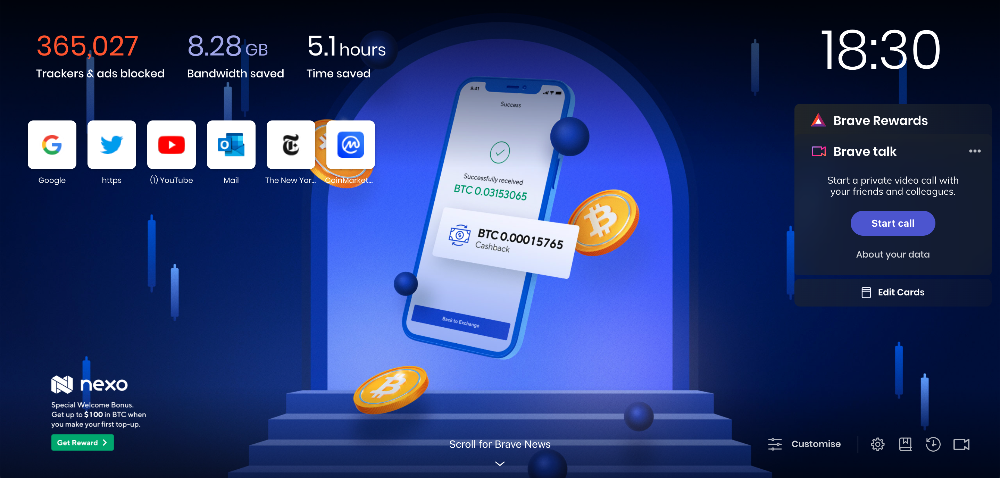
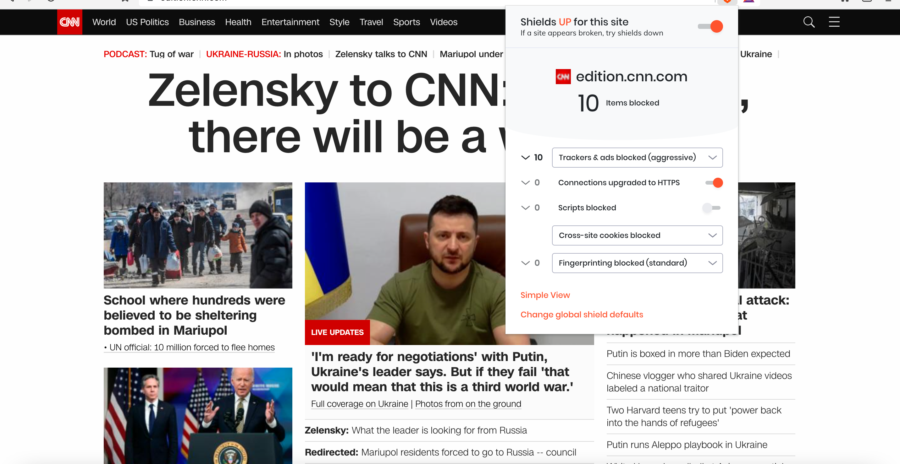
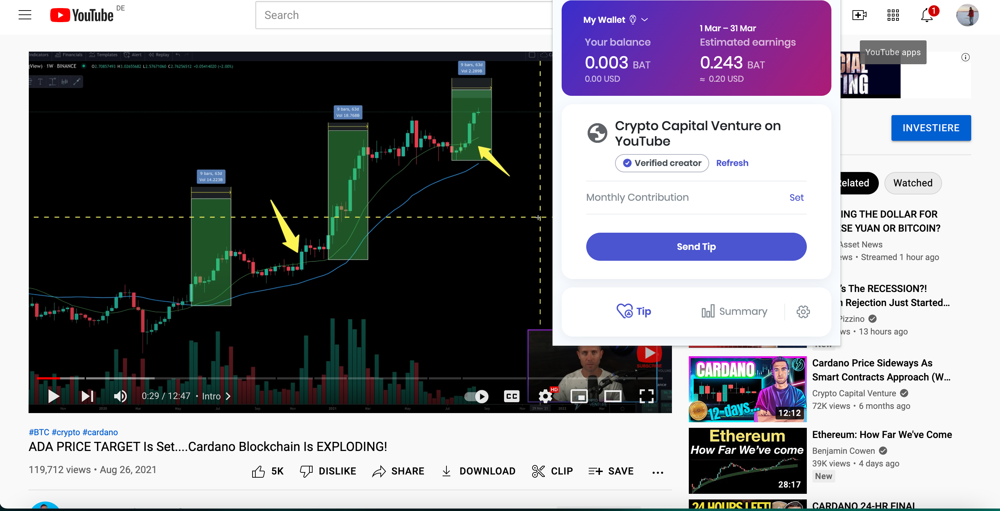

 

#### Why I chose Brave browser over Google Chrome?

The most popular browsers Chrome and others keep your data in their servers and can access
 the data easily. Basically, Google access your data and your personal information is up for 
 sale to highest bidder and you will get nothing in return. On the other hand, Brave browser 
 doesn’t collect any personal information from users and information is stored on your device. 
 In addition, Brave pay users for viewing unanimously match ad inside the browser. 

#### What is Brave Browser? 

Brave is privacy first ad blocking browser. It’s free and open-source browser that built on 
Chromium. Brave Software is founded by Brendan Eich, the creator of Javascript programming 
language. Currently, more than 50 million people are using Brave browser for a faster and safer web.

Brave Browser is gaining lot of attraction and it focuses heavily on user privacy and performance.
 It has robust privacy policy. Cookie control system prevents all websites from tracking and cookies 
 collect no personalized data.

#### Best Ad Blocking Engine

It is built in ad block and it eliminates ads and tracks aggressively. Here you can see the homepage
 which is cleverly designed and shows you all the statistics about your savings.

 

Brave`s motto is to put user back in control of your browsing experience and giving you options to 
choose if you want to use ad-blocking, tracker blocking, view ads, block scripts and prevent fingerprints. 
Under the hood, its all about privacy.

Brave shield let you choose and customize how each and every site you visit is treated in terms of 
ad-block, tracker block, https upgrades, scripts and more..

 

#### Basic Attention Token

Brave created Basic Attention Token (Bat). Its a cryptocurrency that built on Ethereum. Users and content
 creators can get paid with Bat token. Bat token is created for tracking media consumers` time and attention 
 on websites using the Brave Browser. You can earn money with the Brave Browser as a user or as a content creator.

Brave`s ad platform pay users 70% out of total revenue that they earn from the ads. Literally, users can get 
paid while surfing the web through with Brave which is impossible with Google. For users its not mandatory to 
join, users can opt-in  or opt-out whenever they want. Users can buy gift cards or cash out their Bat tokens. 
Users can earn on average 5$ a month without giving up their data. They can even donate their Bat tokens to content 
creators to support them.
 

 

#### Main Advantages of using Brave;

- Best browser for privacy
- Earn money while surfing the web
- Load pages 3x faster than chrome browser
- Easy to use with Vpn one single click
- Browse privately with Tor feature
- Offer 7 search engines such as duckduckgo, google, bing, qwant, startpage and ecosia
- Easy to import your bookmarks and extensions from chrome
- Include built-in password manager
    
 

##### <strong>RISK DISCLAIMER:</strong> Website is for entertainment purposes only. I’m not a financial planner, or a financial analyst or anything to do with finances.
