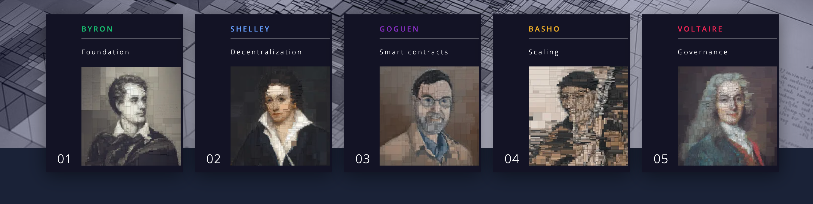
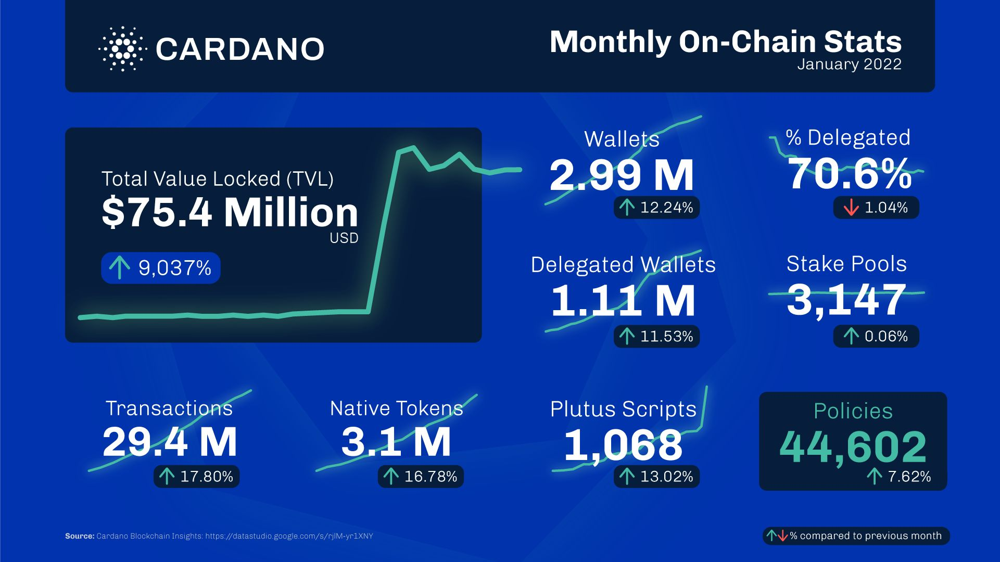

 

#### What is Cardano?
Cardano is a proof-of-stake blockchain platform, in other words financial operating system that launched in 2017 after more than 2 years of development. They built research labs all around the world and published more than hundred-thirty papers which are tested through academic peer review.  Charles Hoskinson, the founder of Cardano would like to build a system that grow organically over the time to millions to 
billions of users. Cardano is a blockchain platform for running smart contracts which allow the development of decentralized apps. Literally, Cardano's academic approach is different than Ethereum's "move fast, break things".
####  What is Proof-of-stake ? 
The cryptocurrency of Cardano called Ada. Cardano uses its own Proof of Stake (PoS) approach called Ouroboros. Cardano allow users to buy and sell their Ada coins on a network running the Ouroboros consensus protocol. Put in simply, staking is a process where Ada holders can deposit their coins on the pool and become validators which means to verify new data thats added the blockchain. They keep the network decentralized and validate transactions so they are rewarded in Ada.

#### Cardano - Third generation blockchain

Crypto 1.0. ⇒ Bitcoin is the first generation blockchain. It is the ground breaking technology that introduce blockchain to the world and it transfers and stores value. Its the digital gold - money of the internet.

Crypto 2.0 ⇒ Ethereum is the second generation blockchain. Ethereum introduced smarts contracts to the world which is a program that runs on the blockchain and enable decentralized applications to built on top of their blockchain. Ethereum is the most popular blockchain for running smart contracts but its unstable and has security and scalibility problems. It caused losses of 10.5 billion in the decentralized finance (Defi) space in 2021. The more dapps built on Ethereum blockchain, the more network congested and cause high gas fees.

Crypto 3.0 ⇒ Cardano is the third generation blockchain which aims to solve the challenges which bitcoin and ethereum facing at the moment, which are scalability, interopability, governance and decentralized. The team behind Cardano has been inspired by the world of science publishing, and has adopted its peer-reviewed approach for their cryptocurrency. Cardano released Alonzo hard fork upgrade last year which gives smart contract functionality and enhance flexibility.

#### Native asset standard

Everybody is able to mint their own native assets on Cardano. Native asset standard make it cheaper and easier to issue an asset on Cardano than any other blockhains.
These tokens have all the key features and functionalities which is smilar to Cardano's native currency Ada. Essentially, your asset
is treated the same as Ada treated.

#### Planting one million trees

Cardano blockchain reached its goal of planting more than 1 million trees, the Cardano Forest is 100% funded.
Cardano is going to completely become carbon negative via planting trees. Their goal is planting over 1 billion trees the next several years.
There is heaps of critisim in recent years that blockchain 
is not safe for the environment. Especially, mining bitcoin using huge amounts of electricity to keep running
because they use huge computing resources in order to solve a cryptographic puzzle. Proof of work take lots of energy and can never be energy efficient.
Blockchain like Cardano run on a proof-of-stake concept that relies on network validators who deposit their 
coins on nodes to maintain the blockchain. It is more environmentally friendly than mining .

#### Cardano's Africa Vision 
#### Real Use cases

Half of the African population lacking access to verification of identities. More than 500 million Africans don't have any formal
documentation which creates barrier for taking loans and can't open bank accounts. It causes in increased identity fraud in Africa. Interest
rates in Africa is above 20% a year for borrowers and its a big obstacle for startup businesses to access the fund.
Charles Hoskinson would like to take lead in decentralized finance (Defi) space with partnerships in Africa. According to the Hoskinson,
decentralized finance can create liquidity for the poorest people in Africa and help them to build their wealth. In 2021, Cardano announced 
partnerships with Ethiopian government in order to deploy a national blockchain based student and teacher ID. They are giving digital identiy to Ethiopians 
and pull them into the financial system. This 
deal involves 5 million students who are using the “Atala Prism” technology which is decentralized identity solution built 
on the Cardano blockchain. Every student has digital identity on the blockchain and it will travel them throughout their academic 
life and into the economic world. After the graduation, this infrastructure can be used for getting a loan, buying property so on and so forth..
Ethiopian government set out its National Digital Transformation Strategy - Ethiopia 2025 to establish national identiy system and digitize the country.
Cardano has partners in Tanzania, World Mobile Group which wants to connect to unconnected and its the first mobile network built on blockchain.
 During his Africa trip, Charles Hoskinson met lots of politicians in Egypt, 
Kenya , South Africa, Burindi and Tanzania last year. It is highly likely that Cardano might announce big partnerships with African 
countries this year. Cardano is pushing the limits to spread their vision 
accross the continent in order to banking the unbanked.

#### Cardano Road Map 2022 - Basho Phase

 [Image by Cardano](https://roadmap.cardano.org/en/basho/)  

Cardano is entering the Basho phase and they are investing heavily into scaling, optimization and interoperability. 
“Hydra “ is the  layer 2 solution for Cardano. Hydra will able to offload huge amounts of transactions which comes from all the apps. 
Via this model, transactions will be way safer and cheaper on cardano blockchain. After the Alonzo Hard fork, smart contract functionality 
is deployed on Cardano blockchain and more than 200 dapps are under the construction at the moment. The most prominent dex Sundaeswap launched its mainnet last month and more dexes
are going to run on the ecosytem soon. Total unique cardano wallets hits 3 million milestone. It is expected that this number will grow exponentially during this year and attract more investors into the Cardano.
  

