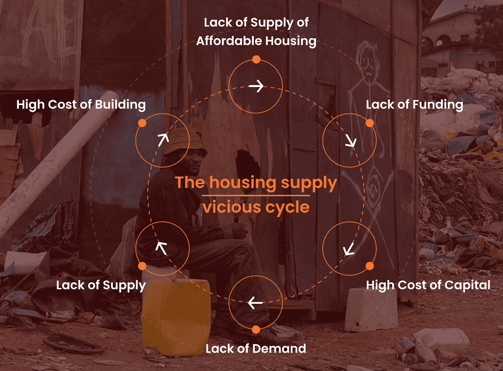
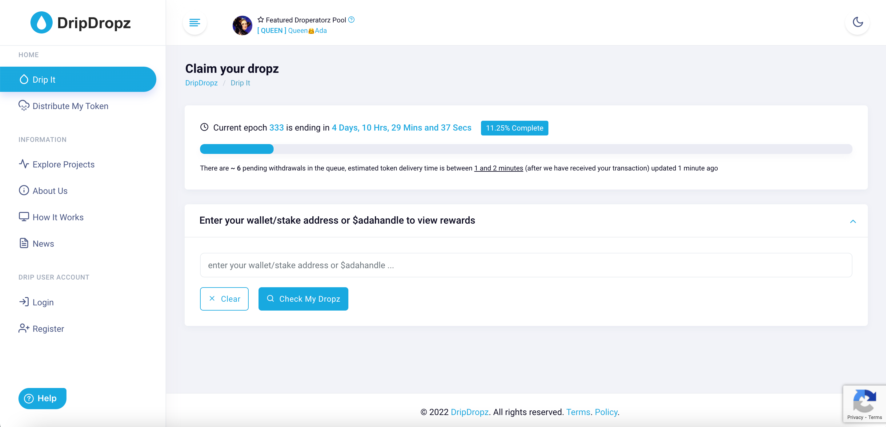
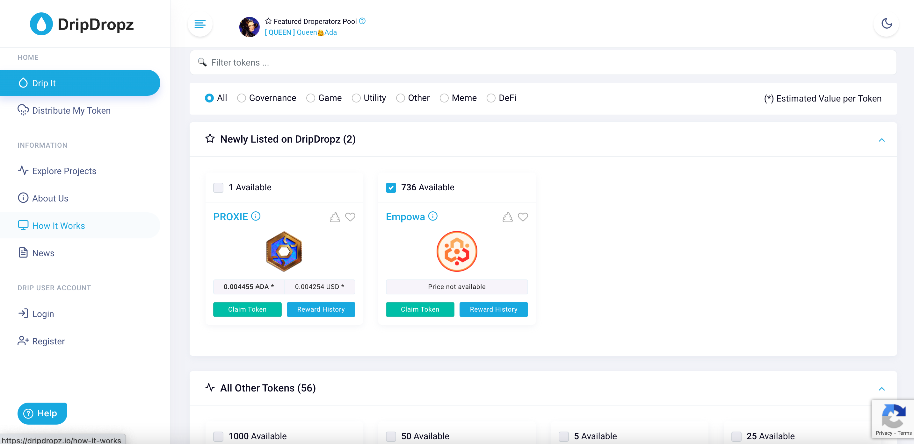
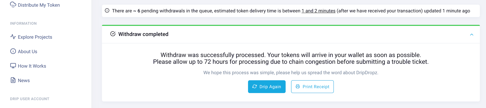

 

import YouTubeEmbed from '../../src/components/youtube-embed'

#### Realfi on Cardano

On Cardano blockchain, there are almost 900 dapps are running on currently and realfi is one of the hottest
 topic in Cardano community.  Realfi stands for “Real finance”.
 Basically, realfi is an ecosystem that connecting crypto liquidity to real world asset classes to offer 
 attractive returns to crypto holders and cheaper products for real people in return. In other words, 
 it is a platform that remove barriers for financing the real world economic activities. For example, 
 __[World Mobile](https://nesilozer.com/blog/worldmobile/)__ is a great example which providing cheaper internet across Africa. Another project is 
 Empowa that focused on affordable and sustainable houses for Africans. Lets deep dive into this great 
 realfi project.

#### Housing problem in Africa

500 million people is living in extreme poverty in Africa and its not caused by lack of money. Poor governance and corruption are the main reasons of this extreme poverty. Unfortunately, structural system doesn't work properly. For instance, Mozambique's population is 30 million people and the country has only 600 mortgages. Mortgage interest rates are between 25-45% due to political, country and currency risks. Majority of the houses are built by African families due to extreme poverty.

 

#### What is Empowa?

__[Empowa](https://empowa.io/)__ is a decentralized first Realfi property platform on Cardano blockchain that provides sustainable and affordable eco-friendly houses in Africa. They would like to use Cardano blockchain in a way to build big community and reduce poverty across Africa. It is powered by EMP token and the project is going to tackle 1 trillion dollar finance gap for affordable housing in Africa continent.

#### EMP Token and Impact Cards

The Empowa platform has a utility token which is called EMP. Users can buy “Impact cards" with EMP tokens or with fiat currency. Impact cards represent the amount of funding from an investor. These impact cards directly correlates to the return the profit from tennant's rent. Basically, EMP tokens are going to finance for construction to begin. Once the house is complete and tennant start paying rent, the rent is deposited into the Empowa platform and convert into EMP tokens. Afterwards, EMP tokens are going to be distributed to impact card owners.

Here is the video from Empowa with more details

<YouTubeEmbed src="https://www.youtube.com/embed/xE5WBUA35kY" />

#### Empowa ISPO

Initial stake pool offering ( ISPO ) is a unique fundraising model in Cardano ecosystem that enable participants to delegate their Ada to a stake pool and receive the token for the project that they want to participate in.

The Empowa Initial Stake pool offering launched on October 4th, 2021 and will be ending on 1st May. It is a successful ISPO that will run for a total of 40 epochs.

#### ISPO Token Distribution

Empowa partnered with DripDropz to distribute EMP token from the
 15th of April. Empowa ISPO delegators can claim their EMP tokens on 6 months 
 linear vesting schedule. Tokens will be available for purchase on Muesli and Adax Cex platforms on 15th April.

 #### How to claim EMP on DripDropz?

 Here are the steps to claim EMP tokens.

 1) Go to the DripDropz website and enter your wallet/stake address and hit the "Check My Dropz" button.

  

 2) Your claimable Emp tokens will show up on the top and tick the box to claim your EMP tokens.

  
 
 3) Afterwards, the amount of ada will be shown to complete to transaction in order to receive EMP tokens.

 4) Once you send the right amount of ada to given address, you will see your status on DripDropz app. ISPO participants
  are allowed to claim specific portion of EMP tokens on each epoch.

  

 
 

 ##### <strong>RISK DISCLAIMER:</strong> Website is for entertainment purposes only. I’m not a financial planner, or a financial analyst or anything to do with finances.

