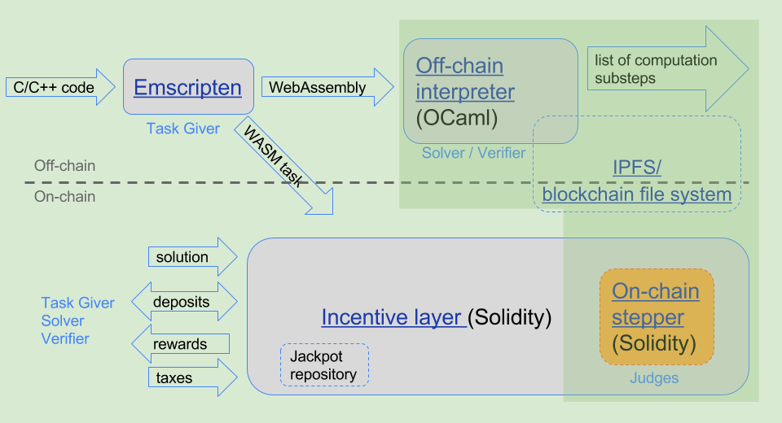

 

Before a deep dive into Truebit protocol, let's start with oracle.

#### What is oracle?

Oracles are data feeds that connect blockchains to trusted off-chain real world information so that you can query data in your smart contract. Blockchain oracles provide external informations to the smart contract.  Basically, oracle can provide any type of data, such as weather forecast, football scores, price of the stock and so forth.

Small computations can be performed smoothly by smart contracts but large computation tasks pose security risks for blockchains such as facial recognition, machine learning or big data. This is where Truebit protocol comes in;

#### What is Truebit?

Truebit protocol founded in 2017 by Jason Teutsch and it has been under development for 5 years. Truebit is a computation oracle for blockchain. This Layer 2 solution sits on top of other existing systems which enables smart contracts securely perform complex computations. It is the technology to help blockchains offload complex or heavy computations. It will let applications do more complex things in a way that can still be verified by the main chain.

#### Verifiers Dilemma

The Verifier`s Dilemma prevent smart contracts from running for more than fraction of a second. Truebit gives Layer 1 solutions and even L2 solutions a computational boost.  Let's have a look at the problem, “Verifiers Dilemma”.

In the proof of work consensus, miners get awarded after solving a cryptographic puzzle. However, proof-of-work protocol has security flaws in terms of incentives. Whoever solves the mathematical puzzle first, get paid while the other miners must do the whole work for free. 

Here is the dilemma;

1) There is no consequences if the miners skip the verification process and race on the next chain to get chance of financial rewards. Therefore, they skip the verification.

2) The problem is they might end up mining on the wrong chain which means other miners will ignore a found block. Therefore, they do the verification.

Truebit introduced a scalable verification mechanism - “ the interactive verification game ” resolves the dispute between a challenger (who disagrees with the solution) and a Solver ( the one who provided a solution to computational task). Its built on 2 layers where anyone can challenge solutions through consensus. You can find more detailed about this mechanism in the ***<em>[whitepaper](https://people.cs.uchicago.edu/~teutsch/papers/truebit.pdf)</em>***

#### Forced Error and Jackpot

For the Truebit protocol to operate smoothly, Verifiers and Solvers need to actively participate in the network. If the Solver provides a correct solution, Verifier doesn’t get any reward as an incentive. If gains keep low, Verifiers eventually leave the network and Solvers would be able to receive rewards, even though submitting a wrong solution. Afterwards, submitting more and more wrong solutions increase the gains for Solvers and attract Verifiers back in the network but it makes the network untrustworthy. Truebit introduced forced error and jackpot system in order to solve this problem. If the Verifier identifies the wrong solution is given a big reward (jackpot). Basically, this incentivize engagement keep the Verifiers in the network and constantly verifiy solutions.

#### Truebit Virtual Machine

In the Truebit Virtual Machine, when smart contract need some computational boost, c/c++ code is transformed into WebAssembly code by Emscripten compiler and it access the IPFS, off-chain. Here is the picture to clarify how system works. 
 

 
##### [Image by Jason Teutsch](https://medium.com/truebit/truebit-whitepaper-addendum-69da1b492df0)

### Whats the problem with Ethereum?

Ethereum has scalability problem for years. There are more than 3000 dapps running on Ethereum blockchain and the number of computationally intensive process on the blockchain hit all time high, it clogs up the network and cause congestion and high gas fee. This  is the biggest problem for  Ethereum`s scalability and its impossible for Ethereum to perform huge computational tasks on the blockchain.  Truebit might be the ultimate solution for Ethereum to reduce gas fees and faster transaction times for large computational tasks. The founder of Ethereum , Vitalik Butherin made a post about Truebit, here is the ***<em>[link](https://ethresear.ch/t/evm-optimistic-rollup-using-truebit/9318)</em>***

Interesting facts about Truebit Protocol.

1. The founder of Ethereum, Vitalik Butherin co-authored the white paper with Jason Teutsch.

2. Christian Reitwether co-wrote the Truebit white paper with Jason Teutsch. Christian Reitwether is the team lead at Ethereum and the creator of solidity programming language.

3. Fred Ehrsam is one of the early investor of Truebit protocol. Fred Ehrsam is a billionaire and co-founder of Paradigm and previously co-founder of Coinbase.  

##### <strong>RISK DISCLAIMER:</strong> Website is for entertainment purposes only. I’m not a financial planner, or a financial analyst or anything to do with finances.
